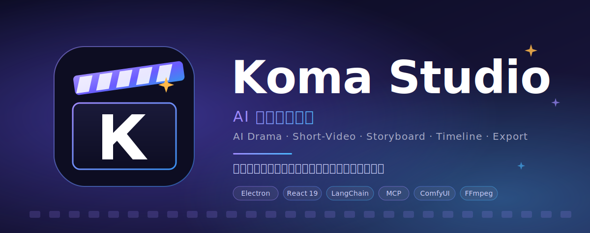
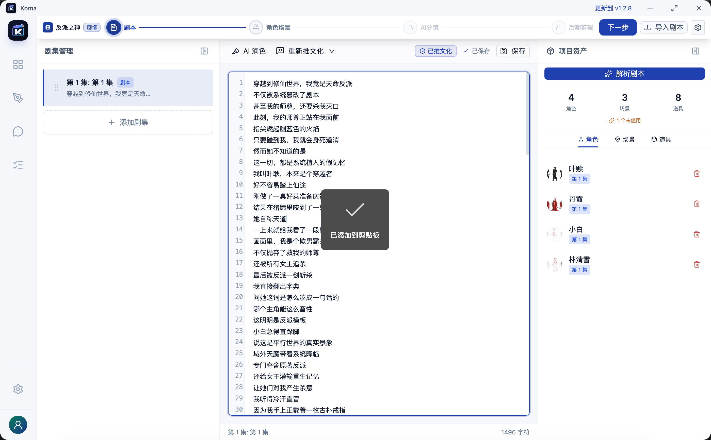
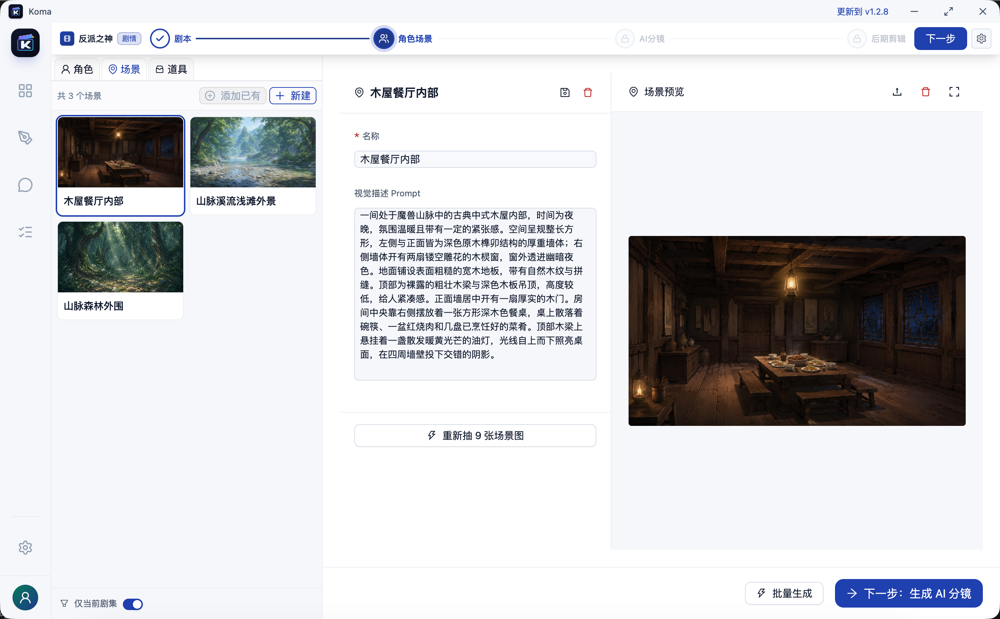
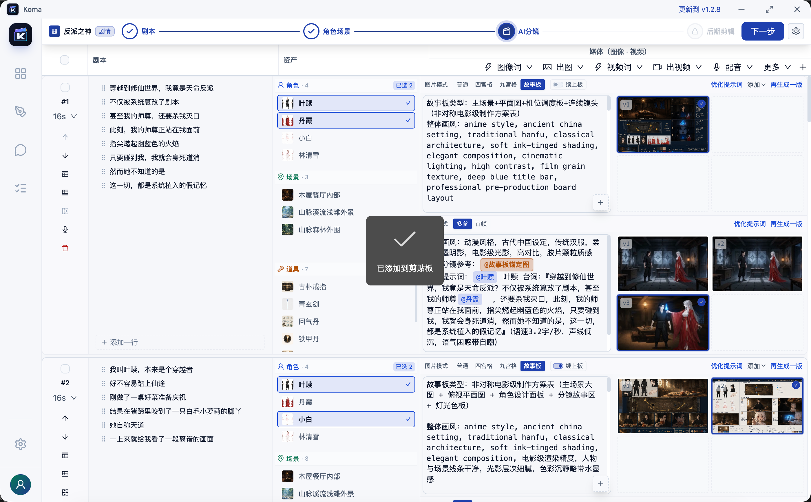
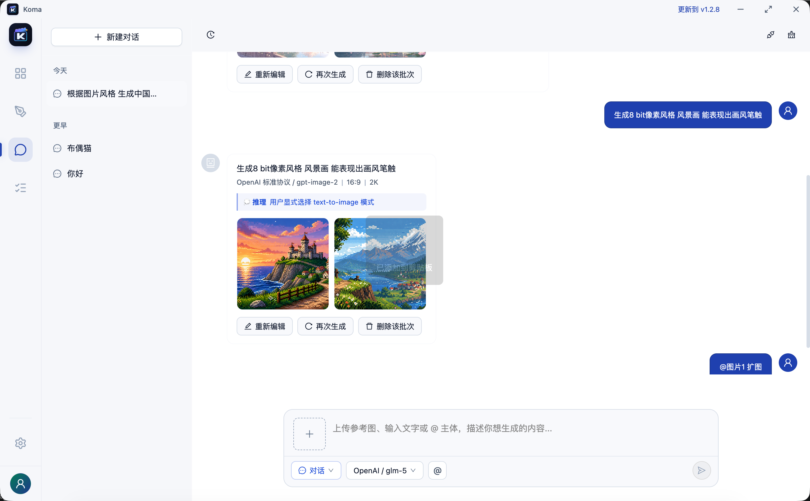
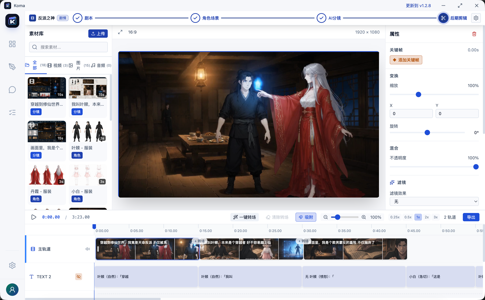
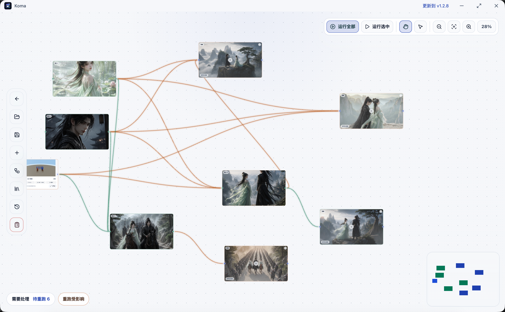
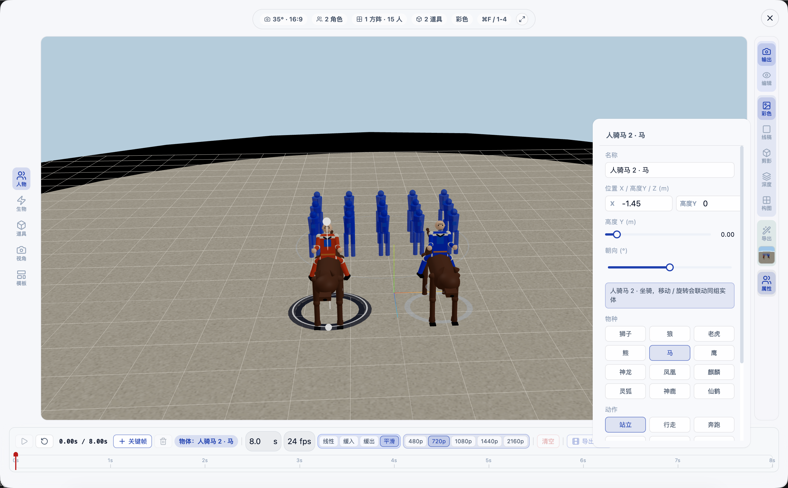

<div align="center">



# Koma Studio

**AI 短剧创作工具** · **AI Drama / Short-Video Creation Studio**

把一个故事想法，一路推进到一段可发布的视频。

[功能](#功能特性) · [截图](#功能截图) · [下载](#下载) · [快速开始](#快速开始) · [交流与联系](#交流与联系) · [License](#license)

</div>

---

## 简介

Koma Studio 是一款面向 AI 漫剧、短剧和连续视频内容生产的**本地桌面创作工具**。它把剧本、角色、场景、分镜、图像生成、视频生成、语音合成、时间线剪辑和成片导出集成在同一个工作台里。

整套流程在本地运行，AI 能力通过可配置的 Provider 接入（OpenAI / Claude / Gemini / ComfyUI / Kling / Runway / Pika / Sora 等），创作过程数据保存在你自己的设备上。

> 本仓库是 Koma Studio 的**开源主仓库**，包含桌面端已开源功能的完整源码。

## 功能特性

### 剧本与资产

- **剧本编辑** — `@` 提及角色 / 场景 / 道具，关键词智能高亮，AI 辅助续写润色
- **资产管理** — 角色、场景、道具统一项目化管理
- **AI 参考图生成** — 角色定妆照、场景氛围图、道具参考图
- **剧本拆解** — 从剧本中提取角色、场景、道具与可视化线索

### 分镜与生成

- **分镜板** — 可视化分镜，关联资产、相机预设、风格参考
- **单张分镜生成** — 基础单图分镜生成
- **资产参考接入** — 角色/场景/道具作为生成参考，提升连续镜头一致性
- **多宫格分镜** — 四宫格、九宫格、电影级故事板模式
- **批量分镜生成** — 批量生成分镜图片与分镜视频
- **首尾帧 / 参考生视频** — 高级视频生成模式

### AI 工作台

- **AI 对话工作台** — LangChain + MCP，多模型可切换
- **Provider 框架** — LLM / TTI / TTS / ITV 多类 AI 能力接入

### 视频剪辑与导出

- **视频时间轴** — 多轨道、关键帧动画、转场，配合 xgplayer 预览
- **FFmpeg 导出** — MP4 / WebM / GIF
- **剪映导出** — 一键导出为剪映草稿格式

### 平台能力

- **插件系统** — Provider / 节点 / 主题可扩展，详见 [`docs/PLUGIN_DEVELOPMENT.md`](docs/PLUGIN_DEVELOPMENT.md)
- **主题系统** — 语义化 token，可自定义视觉风格，详见 [`docs/THEME_DEVELOPMENT.md`](docs/THEME_DEVELOPMENT.md)
- **多语言** — 中文 / 英文，i18next 框架
- **本地存储** — 项目数据保存在本地，better-sqlite3 + electron-store

## 功能截图

### 剧本编辑器



### 资产管理



### 分镜板



### AI 对话工作台



### 视频时间轴



### 灵绘节点工作台



### 3D 导演工作台



## 技术栈

| 层 | 选型 |
|---|---|
| 前端 | React 19 · TypeScript · Vite 6 · Ant Design 6 · Tailwind CSS 4 |
| 桌面端 | Electron 39 · ee-core |
| 状态 | Zustand 5 |
| 编辑器 | CodeMirror 6 |
| AI | LangChain · MCP (Model Context Protocol) |
| 存储 | better-sqlite3 · electron-store |
| 视频 | xgplayer |
| 测试 | Vitest |

## 下载

预编译安装包请在本仓库的 [Releases](../../releases) 页面下载：

- **macOS** — `.dmg`（提供 Apple Silicon 与 Intel 版本）
- **Windows** — 安装版 `.exe` / 便携版 `.exe`
- **Linux** — `.AppImage`

应用内置自动更新，安装后即可在有新版本时收到提示。

## 快速开始

### 环境要求

- Node.js >= 18
- npm >= 9
- macOS / Windows / Linux 桌面环境（开发需 Electron 调试）

### 从源码运行

```bash
git clone https://github.com/M-JYuan/Koma.git
cd Koma
npm run install:all     # 安装根目录 + frontend + electron 依赖
npm run dev             # 启动前端 + Electron
```

### 构建打包

```bash
npm run build           # 构建前端与 Electron
npm run build-m-arm64   # 打 macOS Apple Silicon
npm run build-m         # 打 macOS Intel
npm run build-w         # 打 Windows
npm run build-l         # 打 Linux
```

### 测试与校验

```bash
cd frontend && npm test          # 单元测试
cd frontend && npm run test:coverage

npm run verify:all               # 插件 SDK / IPC 白名单校验（仓库根目录）
```

## 项目结构

```
.
├── frontend/          React 前端
│   └── src/
│       ├── components/   UI 组件
│       │   ├── asset       角色 / 场景 / 道具资产管理
│       │   ├── chat        AI 对话面板
│       │   ├── common      通用 UI（侧边栏 / TaskStatusBar / WindowControls）
│       │   ├── editor      剧本与视频时间轴编辑器
│       │   ├── plugins     插件管理与宿主
│       │   ├── project     项目列表与设置
│       │   ├── settings    应用设置页
│       │   ├── storyboard  分镜板
│       │   └── video       视频生成 UI
│       ├── chat/         AI 对话核心逻辑
│       ├── editor/       剧本编辑器内核 (CodeMirror)
│       ├── engine/       视频播放引擎与关键帧插值
│       ├── workflow/     工作流（资产生成、分镜渲染、视频导出）
│       ├── manju-dsl/    Manju DSL 协议转换
│       ├── providers/    LLM / TTI / TTS / ITV Provider 抽象与实现
│       ├── services/     业务服务（TaskManager / 媒体上传 / 激活等）
│       ├── store/        Zustand 状态与持久化
│       ├── theme/        主题系统
│       ├── i18n/         国际化
│       ├── hooks/        React Hooks
│       ├── utils/        工具函数
│       └── types/        类型定义
├── electron/          Electron 主进程 (LangChain / MCP / SQLite)
├── packages/          共享包（plugin-sdk 等）
├── docs/              开发文档（插件 / 主题）
├── prompts/           AI 提示词模板
├── scripts/           构建脚本
└── assets/            README 图片资源
    ├── banner/           顶部 Banner
    ├── screenshots/      功能截图
    └── contact/          交流群二维码
```

## 配置

应用内置设置页支持配置：

- **LLM** — API Key、模型、端点
- **图像生成 (TTI)** — ComfyUI、Gemini、Seedream 等
- **语音合成 (TTS)** — Edge TTS、Fish Audio、GPT-SoVITS 等
- **视频生成 (ITV)** — Kling、Runway、Pika、Sora 等

## 交流与联系

欢迎加入 Koma Studio 交流群，第一时间获取版本更新、使用反馈和内测信息。

<div align="center">
  
</div>

如二维码过期，欢迎在 [Issues](../../issues) 留言说明，维护者会更新新的入群方式。

- Bug 与功能建议：[新建 Issue](../../issues/new/choose)

## 贡献

欢迎任何形式的贡献，详见 [CONTRIBUTING.md](CONTRIBUTING.md)。

- 报告 Bug：[新建 Issue](../../issues/new?template=bug_report.md)
- 提议功能：[新建 Feature Request](../../issues/new?template=feature_request.md)
- 提交 PR：从 `main` 切出特性分支，遵循 Conventional Commits

## License

本仓库代码采用 [GNU General Public License v3.0](LICENSE) 协议开源，任何派生作品也必须在 GPL-3.0 协议下开源。

## 友情链接

本项目在 [LINUX DO](https://linux.do) 公益推广，[LINUX DO](https://linux.do) 是一个真诚、友善、团结、专业的新型综合性社区，欢迎来玩。
